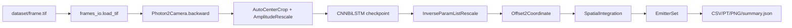

# SRST 项目完整运行手册（Windows 11）

本文面向第一次拿到 SRST 项目的人，覆盖环境安装、GPU/CPU 推理、旧 notebook、训练、输出验收、测试和常见故障。推荐先完成“预训练 demo”，确认环境可用后再运行 notebook 或尝试训练。

## 1. 项目做什么

SRST（super-resolution spatiotemporal information integration）使用深度学习模型，从高密度单分子定位显微镜（SMLM）图像序列中预测分子位置、光子数、三维坐标和不确定度，然后把预测结果保存为 emitter 集合并绘制重建图。

仓库中有三条使用路线：

1. **预训练 demo**：直接使用仓库内的 `network/experiment1/model_2.pt`，不训练，适合第一次运行和给别人演示。
2. **旧版 fitting notebook**：使用 `fitting.ipynb` 读取 TIFF 并逐单元查看定位、重建和过滤结果。它现在已经兼容 CPU/GPU，并会自动寻找项目根目录。
3. **从头训练**：使用 `train.py` 生成模拟数据、训练网络、保存 `model.pt` 和 checkpoint。训练需要 GPU、较长时间以及额外的训练依赖，不应和预训练 demo 混为一条路线。

预训练 checkpoint 是自定义的 `Net.CNNLSTM.CNNBiLSTM` 网络，因此 demo 不能使用通用的 DECODE `SigmaMUNet` 推理入口。`param_run.yaml` 中的 `architecture: SigmaMUNet` 是历史训练配置，不能据此替换 demo 的 checkpoint 网络。

## 2. 项目目录和关键文件

```text
SRST/
├─ dataset/frame.tif                         示例 TIFF，100 帧，180×179 像素
├─ network/experiment1/model_2.pt           已训练 checkpoint，预训练 demo 必需
├─ network/experiment1/param_run.yaml       相机、缩放、后处理和训练参数
├─ psfmod/spline_calibration_3dcal.mat      spline PSF 标定文件，训练/模拟必需
├─ demo.py                                  推荐的命令行预训练推理入口
├─ fitting.ipynb                            修复后的旧 notebook
├─ train.py                                 从头训练入口
├─ Choose_Device.py                         自动选择 cuda:0 或 CPU
├─ Net/                                     CNNBiLSTM、UNet 等项目网络
├─ decode/                                  DECODE 推理、后处理、渲染和工具代码
├─ generic/                                 模拟数据和 emitter 生成辅助代码
├─ LossFunction/                            训练损失相关代码
├─ environment-windows-demo.yml             Windows 预训练/notebook 环境
├─ requirements-windows-demo.txt            Python 依赖和 CUDA PyTorch wheel
├─ install_windows.bat                      创建/更新环境并做安装验证
├─ setup_and_run_demo.bat                   安装后立即运行 demo
├─ run_demo_windows.bat                     在已有环境中运行 demo
├─ README_WINDOWS.md                        Windows 快速说明
└─ PROJECT_STEP_BY_STEP_CN.md               本完整手册
```

预训练 demo 直接推理需要前三个文件；完整项目安装器和训练/模拟路线还会检查 spline 标定文件：

```text
预训练 demo：
dataset/frame.tif
network/experiment1/model_2.pt
network/experiment1/param_run.yaml

训练/模拟额外需要：
psfmod/spline_calibration_3dcal.mat
```

安装器仍会检查四个文件，目的是保证 ZIP 是完整项目包。`demo.py` 的纯推理路径不会直接读取 MAT 文件，但 `train.py` 和模拟数据路径需要它。

## 3. Windows 11 前置条件

### 3.1 必需软件

- Windows 11 64 位。
- Miniconda、Anaconda 或 Miniforge。`install_windows.bat` 会优先寻找已有 Conda；若系统有 `winget` 且没有 Conda，会尝试自动安装 Miniforge。
- VSCode 和 VSCode 的 Jupyter/Python 扩展，用于打开 notebook。
- 能够访问 PyPI 和 `download.pytorch.org` 的网络，用于下载依赖。

### 3.2 GPU 用户

- 安装并更新 NVIDIA Studio 或 Game Ready 驱动。
- 如果普通终端中的 `nvidia-smi` 失败、管理员终端成功，则必须以管理员身份运行安装脚本，并以管理员身份启动 VSCode；否则程序会按照设计回退到 CPU。
- 不需要另外安装 CUDA Toolkit。环境中的 PyTorch 使用 CUDA 12.8 wheel，自带运行时；驱动负责提供 GPU 接口。

在管理员 PowerShell 中先检查：

```powershell
nvidia-smi
```

能看到显卡、驱动版本和显存，才继续安装。

## 4. 解压和安装环境

### 步骤 1：解压项目

将 ZIP 解压到一个路径简单的目录，例如：

```text
D:\work\SRST
```

建议避免中文、空格、OneDrive 同步目录和过深的路径。解压后确认 `dataset`、`network`、`psfmod` 与安装脚本处于同一层级。

### 步骤 2：管理员运行安装器

右键 `install_windows.bat`，选择“以管理员身份运行”。它会依次执行：

1. 固定当前工作目录为项目根目录。
2. 检查四个核心资产。
3. 查找 Miniconda/Anaconda/Miniforge；必要时通过 `winget` 安装 Miniforge。
4. 创建或更新名为 `srst_demo` 的 Conda 环境。
5. 安装 Python 3.9、`spline`、科学计算包、Jupyter、`ipykernel` 和 PyTorch CUDA 12.8 wheel。
6. 导入 `torch`、`spline`、`decode`、`demo`、Jupyter 等模块。
7. 打印 PyTorch 版本、CUDA runtime、CUDA 是否可用和 GPU 数量。
8. 如果发现 `nvidia-smi`，执行 9 帧 CUDA smoke test。
9. 注册 VSCode/Jupyter 内核：`SRST (srst_demo)`。

也可以双击 `setup_and_run_demo.bat`，它在安装成功后继续运行一次预训练 demo。

### 步骤 3：手工验证环境

管理员 PowerShell 中执行：

```powershell
conda env list
conda run -n srst_demo python -c "import torch; print(torch.__version__); print(torch.version.cuda); print(torch.cuda.is_available()); print(torch.cuda.device_count())"
```

GPU 正常时，四项应类似：

```text
2.8.0+cu128
12.8
True
1 或更大的数字
```

查看 GPU 名称：

```powershell
conda run -n srst_demo python -c "import torch; print(torch.cuda.get_device_name(0) if torch.cuda.is_available() else 'CPU fallback')"
```

## 5. 运行预训练 demo

### 5.1 默认快速运行

```powershell
run_demo_windows.bat
```

默认处理前 20 帧，自动选择 CUDA；如果 CUDA 不可见，则使用 CPU。

### 5.2 明确指定 GPU

```powershell
run_demo_windows.bat --device cuda:0 --max-frames 20
```

多卡机器可将 `cuda:0` 改成 `cuda:1`、`cuda:2` 等。当前代码会把模型和 `Infer` 放到指定 GPU；相机逆变换保留在 CPU，是为了兼容 Windows DataLoader 和减少多进程设备问题。

### 5.3 低显存 GPU

```powershell
run_demo_windows.bat --device cuda:0 --max-frames 20 --batch-size 1
```

默认 CUDA batch size 使用 DECODE 的自动探测；手动指定 1、2 或 4 可以降低显存占用。

### 5.4 处理完整 TIFF

```powershell
run_demo_windows.bat --device cuda:0 --max-frames 0
```

`--max-frames 0` 表示完整读取 TIFF；模型的时间窗口为 9 帧，因此指定的帧数不能小于 9。

### 5.5 输出文件

默认输出目录为：

```text
outputs/demo/
├─ emitters.csv          定位结果表
├─ emitters.pt           DECODE EmitterSet
├─ reconstruction.png   快速 XY 重建图
└─ summary.json          设备、帧数、耗时、模型和输出路径
```

`summary.json` 中的 `device`、`cuda_runtime`、`cuda_available`、`cuda_device_name` 和 `batch_size` 可以用来确认实际是否走了 GPU。

## 6. 在 VSCode 中运行旧 fitting notebook

安装器不会自动打开 notebook。安装完成后：

1. 以管理员身份启动 VSCode（如果 GPU 只有提权后可见）。
2. 选择“File → Open Folder”，打开解压后的 `SRST` 根目录。
3. 打开 `fitting.ipynb`。
4. 右上角选择 Python kernel：`SRST (srst_demo)`。
5. 按下面顺序运行代码单元：`0 → 2 → 3 → 5 → 7 → 9 → 11`。

每个关键单元的作用：

- **cell 0**：导入依赖，向上查找项目根目录，并切换到根目录，避免 VSCode 当前工作目录不同导致路径错误。
- **cell 2**：读取 `param_run.yaml`，实例化 `CNNBiLSTM`，加载 `model_2.pt`。
- **cell 3**：定义 `work()`，完成相机逆变换、中心裁剪、振幅缩放、GPU/CPU 推理和空间积分后处理。
- **cell 5**：读取 `dataset/frame.tif` 并推理完整数据。
- **cell 7**：检查第 66 帧的原始图、处理后图和定位结果。
- **cell 9**：绘制未过滤的超分辨率重建图。
- **cell 11**：按照概率和 `sigma_x/sigma_y/sigma_z` 阈值过滤高不确定度定位，并绘制过滤后的结果。

如果 kernel 列表中没有 `SRST (srst_demo)`，在管理员终端执行：

```powershell
conda run -n srst_demo python -m ipykernel install --user --name srst_demo --display-name "SRST (srst_demo)"
```

仓库下 `decode/utils/examples/` 中还有 DECODE 历史示例 notebook，例如 Introduction、Fitting、Fit、Evaluation 和 Training。这些文件保留了旧 kernelspec 和通用 DECODE 模型假设，可能需要手工修改路径或 kernel；第一次运行推荐使用项目顶层的 `fitting.ipynb`。

## 7. 从头训练模型

预训练 demo 不需要训练。如果需要训练新模型，使用项目根目录中的 `train.py`：

```powershell
conda activate srst_demo
python train.py
```

训练前重点检查 `network/experiment1/param_run.yaml`：

```yaml
Hardware:
  device: cuda:0
  device_simulation: cuda:0
HyperParameter:
  epochs: 500
  batch_size: 24
InOut:
  calibration_file: psfmod/spline_calibration_3dcal.mat
```

训练流程大致为：

1. 读取参数和 spline 标定。
2. 通过 `generic.random_simulation.setup_random_simulation()` 生成模拟训练/测试数据。
3. 初始化 DECODE 数据集、CNNBiLSTM、优化器、学习率调度器和 checkpoint。
4. 进行训练、验证和 emitter 匹配评估。
5. 保存 `network/experiment1/model.pt`、`ckpt.pt`、日志和参数副本。

训练需要较大显存和时间。不要用训练脚本生成的通用 `SigmaMUNet` 配置去加载当前 `model_2.pt`；当前 demo 的 checkpoint 由 `Net.CNNLSTM.CNNBiLSTM` 加载。

## 8. 代码数据流



各层职责：

- `decode/utils/frames_io.py`：读取 TIFF。当前增加了对新旧 `tifffile` API 的兼容回退。
- `Net/CNNLSTM.py`：当前预训练 checkpoint 对应的网络结构。
- `decode/neuralfitter/inference`：组织时间窗口、DataLoader、模型前向和输出拼接。
- `decode/neuralfitter/post_processing.py`：阈值、邻近点聚合、空间积分和 EmitterSet 生成。
- `decode/renderer`、`decode/plot`：重建图和定位可视化。
- `generic`、`decode/simulation`、`psfmod`：训练和模拟数据链路。

## 9. 测试和验收

### 9.1 快速验收

```powershell
conda run -n srst_demo python demo.py --device cuda:0 --max-frames 9 --output outputs\smoke
```

检查：

- 命令结束码为 0。
- `outputs\smoke\emitters.csv`、`emitters.pt`、`reconstruction.png`、`summary.json` 存在。
- `summary.json` 中 `device` 为 `cuda:0`，且 `cuda_available` 为 `true`。

CPU 验收：

```powershell
conda run -n srst_demo python demo.py --device cpu --max-frames 9 --output outputs\cpu_smoke
```

### 9.2 单元测试

```powershell
conda activate srst_demo
pytest -q decode/test/test_utils_frames_io.py
```

当前 TIFF 兼容测试预期为 1 个通过、1 个跳过。全量测试包含历史训练/数据加载路径，可能受当前 PyTorch 版本和旧测试假设影响；全量测试未通过时，应先查看具体失败模块，不要直接判断 demo 失败。

## 10. 常见故障

| 现象 | 原因 | 处理 |
|---|---|---|
| `Conda was not found` | 没有 Conda，且 `winget` 不可用 | 安装 Miniconda/Miniforge 后重新运行安装器 |
| 普通终端没有 CUDA，管理员终端有 | GPU 设备访问权限不同 | 管理员运行安装器和 VSCode |
| `nvidia-smi` 有 GPU，但 PyTorch CUDA 为 False | 驱动、环境或 CUDA wheel 不匹配 | 更新 NVIDIA 驱动，删除/更新 `srst_demo`，重新运行安装器 |
| `CUDA was requested, but no CUDA device is available` | 明确指定了 cuda，但当前进程看不到 GPU | 改用管理员终端，或使用 `--device auto/cpu` |
| GPU out of memory | batch size 太大 | 使用 `--batch-size 1`，并减少 `--max-frames` |
| `Required demo asset is missing` | ZIP 解压层级错误或文件缺失 | 确认四个核心资产位于文档指定路径 |
| notebook kernel 不存在 | kernel 尚未注册 | 重新执行 `ipykernel install` 命令 |
| `max_frames must be at least channels_in (9)` | 输入帧数少于模型窗口 | 使用至少 9 帧 |
| `tifffile.imread(... multifile=...)` 报错 | tifffile 新旧 API 差异 | 使用仓库中的 `decode/utils/frames_io.py`，不要替换回旧实现 |
| demo 能运行但用了 CPU | 当前进程没有 CUDA 可见性 | 查看 `summary.json`，管理员启动 VSCode/终端后重试 |

## 11. 不建议的做法

- 不要直接复用旧的 `environment.yml` 作为新 Windows 环境。它包含机器相关的绝对 `prefix`，并混用了旧版 Conda CUDA 和 pip CUDA 包。
- 不要删除 `network/experiment1/model_2.pt`、spline 标定或示例 TIFF 后再判断安装失败。
- 不要把当前 `model_2.pt` 交给通用 `SigmaMUNet` 入口。
- 不要在 notebook 中跳过 cell 2 或 cell 3 后直接运行后续可视化单元。
- 不要把 CUDA 设备硬编码进相机 DataLoader 预处理；当前 CPU 预处理是 Windows 稳定性设计。

## 12. 修改代码后的最小验证顺序

```powershell
python -m py_compile demo.py decode/utils/frames_io.py
python -c "import json, ast; d=json.load(open('fitting.ipynb', encoding='utf-8')); [ast.parse(''.join(c.get('source', [])), feature_version=(3, 8)) for c in d['cells'] if c.get('cell_type') == 'code']; print('notebook syntax ok')"
pytest -q decode/test/test_utils_frames_io.py
conda run -n srst_demo python demo.py --device auto --max-frames 9 --output outputs\smoke
```

GPU 主机上再执行：

```powershell
conda run -n srst_demo python demo.py --device cuda:0 --max-frames 9 --batch-size 1 --output outputs\gpu_smoke
```

## 13. ZIP 发布包说明

发布 ZIP 时应保留源代码、模型、数据、标定文件、环境文件、批处理脚本和本手册；应排除 `.git`、`.omx`、`__pycache__`、`*.pyc`、`.pytest_cache` 和运行产生的 `outputs`，避免把本机缓存或历史输出带给使用者。

解压后，使用者只需要从项目根目录运行：

```text
install_windows.bat
```

然后按第 5 节运行 demo，或按第 6 节在 VSCode 中打开 notebook。
