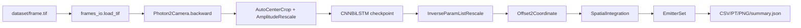

# SRST: Complete Step-by-Step Guide for Windows 11

This guide is for a new user who has just received the SRST project. It covers the project structure, the one-click environment setup, NVIDIA GPU and CPU inference, the legacy notebook, training, output validation, tests, packaging, and troubleshooting.

The recommended order is: install the environment, run the pretrained demo, open the notebook, and only then consider training a new model.

## 1. What this project does

SRST (super-resolution spatiotemporal information integration) uses a deep-learning model to localize high-density single-molecule microscopy emitters. The model predicts detection probability, photon information, 3D coordinates, and uncertainty from a TIFF frame sequence. The predictions are converted to a DECODE `EmitterSet`, saved to disk, and rendered as a reconstruction image.

There are three separate workflows:

1. **Pretrained demo**: runs the checked-in `network/experiment1/model_2.pt` checkpoint. It does not train for 500 epochs and is the recommended first run.
2. **Legacy fitting notebook**: `fitting.ipynb` loads the example TIFF and exposes inference, frame inspection, rendering, and uncertainty filtering cell by cell.
3. **Training from scratch**: `train.py` creates simulated data, trains a network, and writes model/checkpoint files. This is a separate, long-running GPU workflow.

The checked-in checkpoint uses the custom `Net.CNNLSTM.CNNBiLSTM` class. It must not be loaded through the generic DECODE `SigmaMUNet` inference entry point. The `architecture: SigmaMUNet` value in `param_run.yaml` is historical training configuration and does not change the class required by `model_2.pt`.

## 2. Repository layout

```text
SRST/
├─ dataset/frame.tif                         Example TIFF stack (100×180×179)
├─ network/experiment1/model_2.pt           Pretrained checkpoint
├─ network/experiment1/param_run.yaml       Camera, scaling, post-processing, training parameters
├─ psfmod/spline_calibration_3dcal.mat      Spline PSF calibration for simulation/training
├─ demo.py                                  Supported command-line pretrained inference
├─ fitting.ipynb                            Repaired legacy inference notebook
├─ train.py                                 From-scratch training entry point
├─ Choose_Device.py                         Selects cuda:0 when visible, otherwise CPU
├─ Net/                                     CNNBiLSTM and UNet definitions
├─ decode/                                  DECODE inference, post-processing, plotting, rendering
├─ generic/                                 Simulation and emitter-generation helpers
├─ LossFunction/                            Training loss helpers
├─ environment-windows-demo.yml             Curated Windows environment
├─ requirements-windows-demo.txt            Pinned Python dependencies and CUDA PyTorch wheel
├─ install_windows.bat                      Create/update environment and verify it
├─ setup_and_run_demo.bat                   Install and immediately run the demo
├─ run_demo_windows.bat                     Run the demo in an existing environment
├─ README_WINDOWS.md                        Short Windows quick-start
└─ PROJECT_STEP_BY_STEP_EN.md               This complete guide
```

The pretrained inference path needs these three files:

```text
dataset/frame.tif
network/experiment1/model_2.pt
network/experiment1/param_run.yaml
```

The complete project installer and the simulation/training workflow also check:

```text
psfmod/spline_calibration_3dcal.mat
```

The pure `demo.py` inference path does not directly evaluate the MAT file, but `train.py` and the simulation path require it. The installer checks all four files so that the distributed ZIP remains a complete project.

## 3. Windows 11 prerequisites

### 3.1 Required software

- Windows 11 64-bit.
- Miniconda, Anaconda, or Miniforge. The installer searches for an existing Conda installation and can try a per-user Miniforge install through `winget` if none is found.
- VSCode with the Python and Jupyter extensions for the notebook.
- Network access to PyPI and `download.pytorch.org` while the environment is being created.

### 3.2 NVIDIA GPU requirements

The curated environment uses Python 3.9 and the PyTorch 2.8.0 CUDA 12.8 wheel. This is the intended path for current NVIDIA GPUs, including RTX 5090/Blackwell cards; the exact Windows wheels are available from the [PyTorch CUDA 12.8 wheel index](https://download.pytorch.org/whl/cu128/). The wheel includes its CUDA runtime; a separate CUDA Toolkit installation is not required.

Install or update an NVIDIA Studio or Game Ready driver first. Check it from an **Administrator PowerShell**:

```powershell
nvidia-smi
```

If `nvidia-smi` fails in a normal terminal but succeeds in an Administrator terminal, run both the installer and VSCode as Administrator. Otherwise the code intentionally selects CPU because the current process cannot see CUDA.

## 4. Extract and install the environment

### Step 1: Extract the ZIP

Extract the package to a short path without spaces or non-ASCII characters, for example:

```text
D:\work\SRST
```

After extraction, `install_windows.bat`, `dataset`, `network`, and `psfmod` must be directly inside the project root. Do not run the scripts from `network\experiment1` or from a nested duplicate directory.

### Step 2: Run the installer as Administrator

Right-click `install_windows.bat` and choose **Run as administrator**. It performs the following actions:

1. Changes the working directory to the project root.
2. Checks the four required project assets.
3. Locates Miniconda/Anaconda/Miniforge, or tries to install Miniforge with `winget`.
4. Creates or updates the `srst_demo` Conda environment.
5. Installs Python 3.9, the Windows `spline 0.10.0` build, scientific packages, Jupyter, `ipykernel`, pytest, and the explicit PyTorch CUDA 12.8 wheel.
6. Imports `torch`, `spline`, `decode`, `demo`, JupyterLab, and `ipykernel`.
7. Prints the PyTorch version, compiled CUDA runtime, CUDA availability, and device count.
8. If `nvidia-smi` is visible, checks CUDA access and runs a 9-frame CUDA smoke test.
9. Registers the kernel named `SRST (srst_demo)`.

For an install-and-run action, use `setup_and_run_demo.bat`. It calls the installer and then launches the demo.

### Step 3: Verify the environment manually

Use an Anaconda/Miniforge Prompt, or initialize Conda for PowerShell first. Then run:

```powershell
conda env list
conda run -n srst_demo python -c "import torch; print(torch.__version__); print(torch.version.cuda); print(torch.cuda.is_available()); print(torch.cuda.device_count())"
```

On a visible GPU, the last three values should look like:

```text
12.8
True
1 or more
```

Print the device name:

```powershell
conda run -n srst_demo python -c "import torch; print(torch.cuda.get_device_name(0) if torch.cuda.is_available() else 'CPU fallback')"
```

## 5. Run the pretrained demo

### 5.1 Fast default run

```powershell
run_demo_windows.bat
```

The default processes the first 20 frames. `auto` selects `cuda:0` when PyTorch can see CUDA and selects CPU otherwise.

### 5.2 Explicit GPU run

```powershell
run_demo_windows.bat --device cuda:0 --max-frames 20
```

On a multi-GPU workstation, use `cuda:1`, `cuda:2`, and so on. The model and DECODE `Infer` object are placed on the selected GPU. Camera preprocessing remains on CPU deliberately; this avoids Windows DataLoader device/spawn problems.

### 5.3 Low-memory GPU

```powershell
run_demo_windows.bat --device cuda:0 --max-frames 20 --batch-size 1
```

CUDA uses DECODE's automatic batch-size probe by default. Specify 1, 2, or 4 if a low-memory GPU runs out of memory.

### 5.4 Full TIFF stack

```powershell
run_demo_windows.bat --device cuda:0 --max-frames 0
```

`--max-frames 0` means the complete stack. The model uses a 9-frame temporal window, so a nonzero frame count must be at least 9.

### 5.5 Output files

The default output directory is:

```text
outputs/demo/
├─ emitters.csv          Localized emitters
├─ emitters.pt           DECODE EmitterSet
├─ reconstruction.png   Quick XY reconstruction
└─ summary.json          Device, frame count, timing, model, and output paths
```

Use `summary.json` to confirm whether the run used CUDA. The most useful fields are `device`, `torch_version`, `cuda_runtime`, `cuda_available`, `cuda_device_name`, and `batch_size`.

## 6. Run the legacy notebook in VSCode

The installer does not open a notebook. After installation:

1. Start VSCode as Administrator if CUDA is visible only after elevation.
2. Choose **File → Open Folder** and open the extracted `SRST` root.
3. Open `fitting.ipynb`.
4. Select the Python kernel `SRST (srst_demo)`.
5. Run the code cells in this order: `0 → 2 → 3 → 5 → 7 → 9 → 11`.

Cell responsibilities:

- **Cell 0** imports dependencies, finds the repository root, and changes into it so relative paths work from VSCode.
- **Cell 2** loads `param_run.yaml`, instantiates `CNNBiLSTM`, and loads `model_2.pt`.
- **Cell 3** defines `work()`: camera inverse transform, center crop, amplitude scaling, device-aware inference, and spatial integration.
- **Cell 5** loads `dataset/frame.tif` and runs the full inference.
- **Cell 7** compares the raw, processed, and localized view of frame 66.
- **Cell 9** draws an unfiltered super-resolution reconstruction.
- **Cell 11** filters by probability and `sigma_x/sigma_y/sigma_z`, then draws filtered results.

If the kernel is missing, register it again:

```powershell
conda run -n srst_demo python -m ipykernel install --user --name srst_demo --display-name "SRST (srst_demo)"
```

The repository also contains historical DECODE example notebooks under `decode/utils/examples/` (Introduction, Fitting, Fit, Evaluation, and Training). They retain older kernelspecs and generic DECODE assumptions and may require manual path/kernel changes. Start with the top-level `fitting.ipynb`.

## 7. Train a new model

Training is optional. The pretrained demo and notebook do not need it. To train from scratch:

```powershell
conda activate srst_demo
python train.py
```

Before training, inspect `network/experiment1/param_run.yaml`:

```yaml
Hardware:
  device: cuda:0
  device_simulation: cuda:0
HyperParameter:
  epochs: 500
  batch_size: 24
InOut:
  calibration_file: psfmod/spline_calibration_3dcal.mat
```

The training flow is:

1. Load parameters and the spline calibration.
2. Build simulated training/test data with `generic.random_simulation.setup_random_simulation()`.
3. Initialize the DECODE datasets, CNNBiLSTM, optimizer, scheduler, and checkpoint writer.
4. Train, validate, render test predictions, and match emitters.
5. Save `model.pt`, `ckpt.pt`, logs, and a parameter copy under the experiment directory.

Training needs substantial GPU memory and time. Do not load the bundled `model_2.pt` with the generic `SigmaMUNet` class.

## 8. Data flow through the code



The main layers are:

- `decode/utils/frames_io.py`: TIFF loading, including compatibility with old and new `tifffile` APIs.
- `Net/CNNLSTM.py`: the network class required by the bundled checkpoint.
- `decode/neuralfitter/inference`: temporal windows, DataLoader, model forward pass, and batch concatenation.
- `decode/neuralfitter/post_processing.py`: thresholding, neighboring-point aggregation, spatial integration, and EmitterSet construction.
- `decode/renderer` and `decode/plot`: reconstruction and localization visualization.
- `generic`, `decode/simulation`, and `psfmod`: simulation and training data generation.

## 9. Verification and acceptance

### 9.1 Quick smoke test

```powershell
conda run -n srst_demo python demo.py --device cuda:0 --max-frames 9 --batch-size 1 --output outputs\gpu_smoke
```

Verify:

- exit code is 0;
- `outputs\gpu_smoke\emitters.csv`, `emitters.pt`, `reconstruction.png`, and `summary.json` exist;
- `summary.json` contains `device: cuda:0` and `cuda_available: true`.

CPU acceptance:

```powershell
conda run -n srst_demo python demo.py --device cpu --max-frames 9 --output outputs\cpu_smoke
```

### 9.2 Tests

```powershell
conda activate srst_demo
pytest -q decode/test/test_utils_frames_io.py
```

The targeted TIFF compatibility test is expected to pass with one test and skip one optional case. The complete historical test suite includes old training/data-loader assumptions and should be interpreted by its individual failure, rather than used as the only demo acceptance criterion.

## 10. Troubleshooting

| Symptom | Cause | Action |
|---|---|---|
| `Conda was not found` | No Conda and no usable `winget` | Install Miniconda/Miniforge and rerun the installer |
| CUDA is missing in a normal terminal but visible as Administrator | Process/device permission difference | Run installer and VSCode as Administrator |
| `nvidia-smi` sees a GPU but PyTorch says CUDA is unavailable | Driver, wheel, or environment mismatch | Update NVIDIA driver, remove/update `srst_demo`, rerun installer |
| `CUDA was requested, but no CUDA device is available` | Explicit CUDA was requested from a process without GPU access | Use an elevated terminal, or use `--device auto/cpu` |
| GPU out of memory | Batch too large | Use `--batch-size 1` and fewer frames |
| `Required demo asset is missing` | Wrong extraction level or missing file | Check the four assets and run scripts from the project root |
| Notebook kernel is missing | Kernel was not registered | Run the `ipykernel install` command above |
| `max_frames must be at least channels_in (9)` | Fewer than nine input frames | Use at least 9 frames |
| `tifffile.imread(... multifile=...)` fails | Old/new `tifffile` API difference | Keep the repository `frames_io.py` compatibility wrapper |
| Demo runs but reports CPU | Current process cannot see CUDA | Inspect `summary.json`, then relaunch terminal/VSCode elevated |

## 11. Do not use these shortcuts

- Do not use the historical `environment.yml` as the new Windows setup. It contains an absolute machine-specific prefix and mixed legacy CUDA pins. Use `install_windows.bat` and `environment-windows-demo.yml`.
- Do not delete the TIFF, checkpoint, parameter YAML, or spline calibration before diagnosing an installation problem.
- Do not pass `model_2.pt` to the generic `SigmaMUNet` entry point.
- Do not skip notebook cells 2 or 3 and expect later visualization cells to have the required variables.
- Do not force camera preprocessing onto CUDA inside a Windows DataLoader; the current CPU preprocessing is deliberate.

## 12. Minimal verification after code changes

```powershell
python -m py_compile demo.py decode/utils/frames_io.py
python -c "import json, ast; d=json.load(open('fitting.ipynb', encoding='utf-8')); [ast.parse(''.join(c.get('source', [])), feature_version=(3, 8)) for c in d['cells'] if c.get('cell_type') == 'code']; print('notebook syntax ok')"
pytest -q decode/test/test_utils_frames_io.py
conda run -n srst_demo python demo.py --device auto --max-frames 9 --output outputs\smoke
```

On a GPU host, also run:

```powershell
conda run -n srst_demo python demo.py --device cuda:0 --max-frames 9 --batch-size 1 --output outputs\gpu_smoke
```

## 13. ZIP package and LAN deployment

The release ZIP should include source code, data, model, calibration, environment files, batch launchers, notebooks, and this guide. Exclude `.git`, `.omx`, `.agents`, `.codex`, `.aws`, `__pycache__`, `*.pyc`, `.pytest_cache`, notebook checkpoints, and generated `outputs`.

After extraction, the user should see `install_windows.bat`, `dataset`, `network`, and `psfmod` directly in the root. Run the installer from that root.

To verify a downloaded ZIP in PowerShell:

```powershell
Get-FileHash .\SRST-Windows.zip -Algorithm SHA256
```

The SHA-256 value should match the value supplied with the LAN download link.
